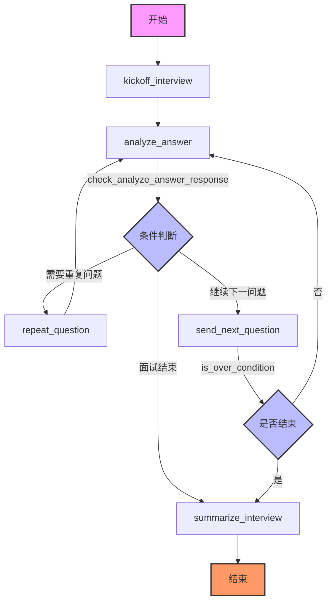

```mermaid
graph TD
        START[开始] --> A[kickoff_interview]
        A --> B[analyze_answer]
        
        B -->|check_analyze_answer_response| C{条件判断}
        C -->|需要重复问题| D[repeat_question]
        C -->|继续下一问题| E[send_next_question]
        C -->|面试结束| F[summarize_interview]
        
        D --> B
        
        E -->|is_over_condition| G{是否结束}
        G -->|是| F
        G -->|否| B
        
        F --> END[结束]
        
        style START fill:#f9f,stroke:#333,stroke-width:2px
        style END fill:#f96,stroke:#333,stroke-width:2px
        style C fill:#bbf,stroke:#333,stroke-width:2px
        style G fill:#bbf,stroke:#333,stroke-width:2px
```